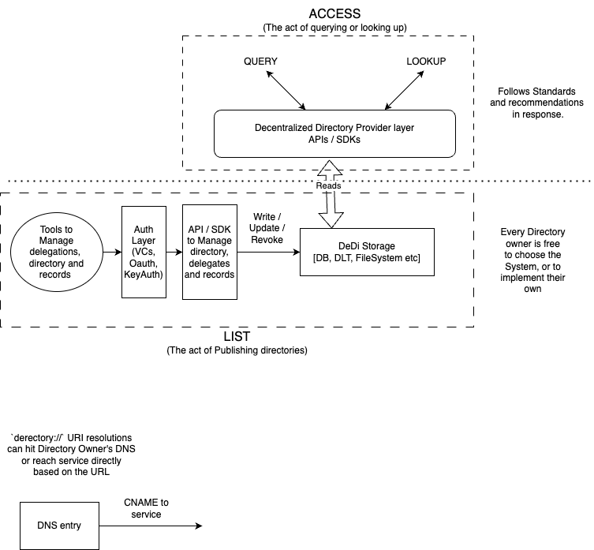

# Decentralised Directory

The Decentralized Directory (DeDi) Protocol is envisioned as a global, interoperable specification for accessing public directories. It unifies access to public information published by registrars, regardless of the underlying technology or jurisdiction, providing a standardized, open-source protocol for real-time look-up of any public registry. This protocol defines directories as a specialized subset of electronic registries containing publicly available information about entities and things. These directories are maintained by Directory Owners, who could be public authorities or trusted semi-public or private entities.

The DeDi Protocol offers a standardized, open-source specification that can be integrated into existing or new systems. It aims to unify diverse implementations, ensuring interoperability and trust across the ecosystem.

